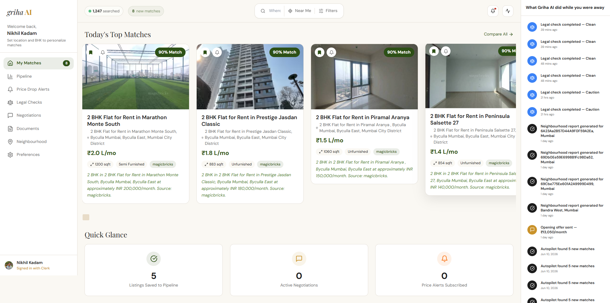
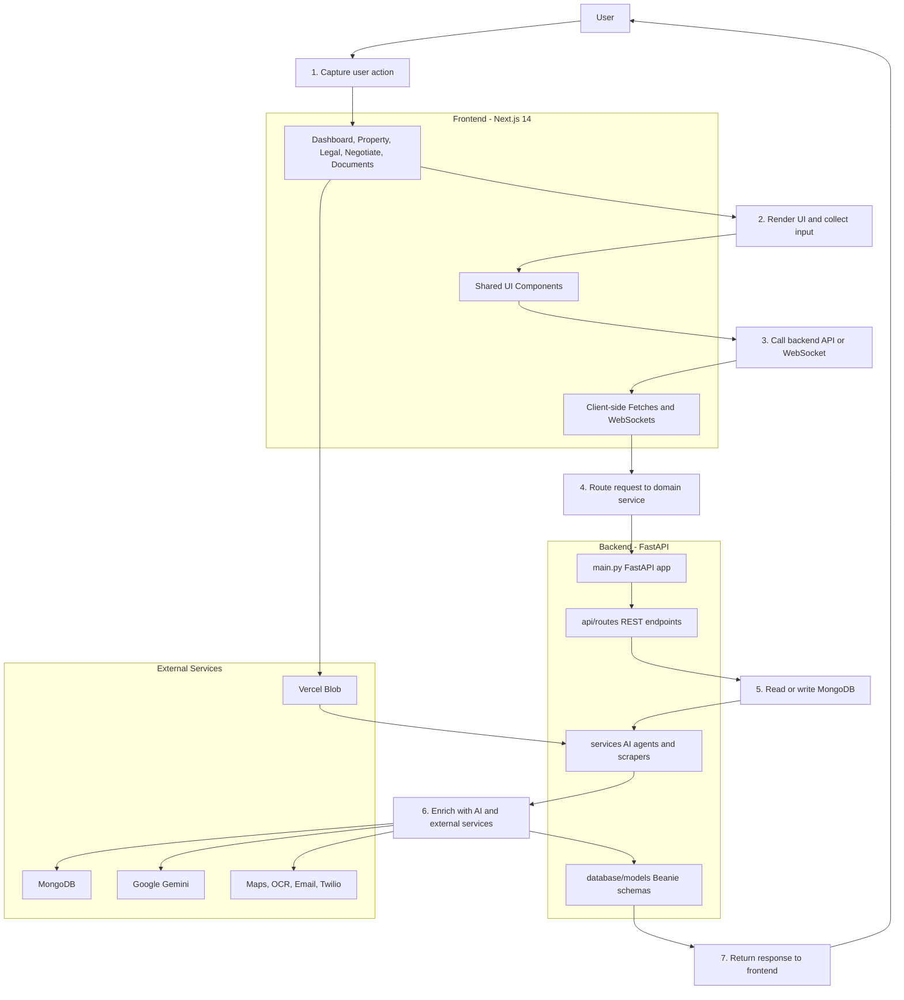



---

## 🏠 What is Griha AI?

Griha AI is a **full-stack, agentic real estate platform** built for the Indian rental and property market. It automates the most painful parts of house hunting — from finding and filtering listings, to negotiating with landlords, verifying legal documents, and understanding the neighbourhood — all powered by Google Gemini AI.

Think of it as your personal real estate agent that never sleeps, never takes a commission, and never hides listings from you.

---

## ✨ Features

### 🎯 AI-Powered Dashboard — Today's Top Matches

The main dashboard shows your top property matches ranked by AI compatibility score. The live **What Griha AI did while you were away** sidebar on the right keeps you updated on every automated action — legal checks, neighbourhood reports, opening offers sent, and new matches found — even when you are offline.

The **Quick Glance** section at the bottom gives you an instant summary of:

- Listings saved to your pipeline
- Active negotiations in progress
- Active price drop alerts

---

### 🏡 Property Detail Page — AI Overview + Actions

Each property page features:

- **AI Property Overview** — a smart Gemini-generated summary highlighting top points and watchouts
- One-click access to **Verify Legal Docs**, **Schedule Visit**, **Negotiate**, **Save to Pipeline**, and **Neighbourhood Report**
- Full property specs, furnishing status, source platform, and a direct link to the original listing

---

### 🗺️ Commute Calculator + Interactive Amenity Map

Type any workplace or destination and instantly get:

- **Driving time** and distance (via OSRM routing engine)
- **Public transit estimate** (including walking time)

The interactive Leaflet map shows **colour-coded markers** for all nearby amenities — hospitals (red), schools (blue), hotels (orange), parks (green), and more. Click any marker to auto-fill the commute calculator with that location.

---

### 💰 Affordability Calculator + Move-in Estimate

Enter your monthly take-home income and Griha AI instantly calculates:

- What **percentage of income** the rent will consume
- Visual rent | utilities | remaining breakdown
- **Total Move-in Estimate** — security deposit (3 months), 1st month advance, brokerage, society transfer charges, and painting costs

---

### 📋 Legal Check Report — Powered by Gemini

Every property gets a comprehensive AI-generated legal dossier covering:

- **RERA Registration** — status, number, complaints filed
- **Encumbrance Certificate** — loans, disputes, bank NOC requirements
- **Property Tax** — compliance with the local municipal corporation
- **Builder Track Record** — developer reputation, delivery history, known legal issues

The report gives an overall verdict: ✅ **Clean** | ⚠️ **Caution** | 🔴 **High Risk** — with a plain-English summary at the top.

---

### 🤖 AI Broker Call — Voice-Powered Negotiation

Griha AI can **roleplay as a broker** in a live voice session. It knows the property details, handles tenant questions, and conducts the entire interaction — so you never have to cold-call an unknown broker again.

---

### 🛎️ Price Drop Alerts

Subscribe to price drop alerts on any property you are watching. Griha AI periodically checks listing prices and notifies you when a drop is detected. The dashboard shows:

- Total active alerts and how many have triggered
- Potential savings if all alerts hit their target
- Historical price snapshots for each listing

---

### 🗺️ AI Neighbourhood Explorer

Explore any neighbourhood through a stunning dark-mode map interface. Select a property and ask Griha AI anything — *Where are the nearest hospitals?*, *Find me good parks within 2km*, *What metro stations are nearby?* — and get natural language answers with markers on the map in real time.

---

### 🤖 Neighbourhood AI Chat

The AI chat, powered by Gemini and OpenStreetMap, answers hyper-local questions about the area around any property — distances, descriptions, and practical advice — like a local friend who knows every corner of the city.

---

### 📄 Document Vault — AI Contract Analysis

Upload any rent agreement, sale deed, or legal document and Griha AI will:

- Extract all clauses automatically
- Flag **high-risk** and **caution** terms in red/yellow
- Let you ask natural language questions like *What is my lock-in period?* or *What is the penalty for early exit?*

---

## 🏗️ Architecture

### Request Flow

1. User triggers an action in the Next.js app.
2. The frontend renders the interaction and sends the request.
3. FastAPI routes dispatch to the correct service layer.
4. Services talk to MongoDB, Gemini, Vercel Blob, and other integrations.
5. The backend returns structured results for the frontend to display.

---

## 🚀 Getting Started

### Prerequisites

| Tool    | Version |
| ------- | ------- |
| Node.js | 18+     |
| Python  | 3.11+   |
| MongoDB | 6+      |

### 1. Clone the repo

`ash git clone https://github.com/yourusername/griha_ai.git cd griha_ai `

### 2. Backend setup

`ash cd backend pip install -r requirements.txt `

Create a .env file in ackend/:
`env MONGODB_URL=mongodb://localhost:27017/griha_ai GEMINI_API_KEY=your_gemini_api_key_here CLERK_SECRET_KEY=your_clerk_secret_key_here `

Start the server:
`ash python -m uvicorn main:app --host 0.0.0.0 --port 10000 --reload `

### 3. Frontend setup

`ash cd frontend npm install `

Create a .env.local file in rontend/:
`env NEXT_PUBLIC_CLERK_PUBLISHABLE_KEY=your_clerk_publishable_key CLERK_SECRET_KEY=your_clerk_secret_key `

Start the dev server:
`ash npm run dev `

Open [http://localhost:3000](http://localhost:3000) 🎉

---

## 🧠 AI Agents

| Agent                  | Purpose                                                          |
| ---------------------- | ---------------------------------------------------------------- |
| LegalAgent             | RERA, encumbrance, property tax, builder track record analysis   |
| NegotiationAgent       | Market research, opening offer generation, counteroffer handling |
| MatchingAgent          | Ranks properties against user preferences                        |
| ContractAgent          | Clause extraction, risk flagging, Q&A on uploaded documents      |
| GeminiExtractor        | Intelligent property data extraction from web listings           |
| NeighbourhoodChatAgent | Geocoding and area-aware conversational AI                       |

---

## 📜 License

MIT License — feel free to use, modify, and build on top of this project.

---

  
Built with ❤️ for Indian home seekers

  
<em>No broker. No commission. No nonsense.</em>

